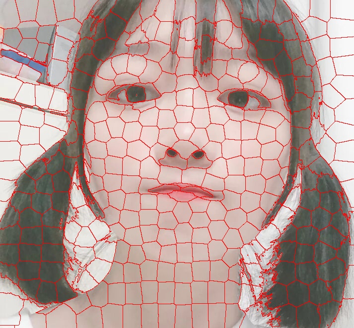
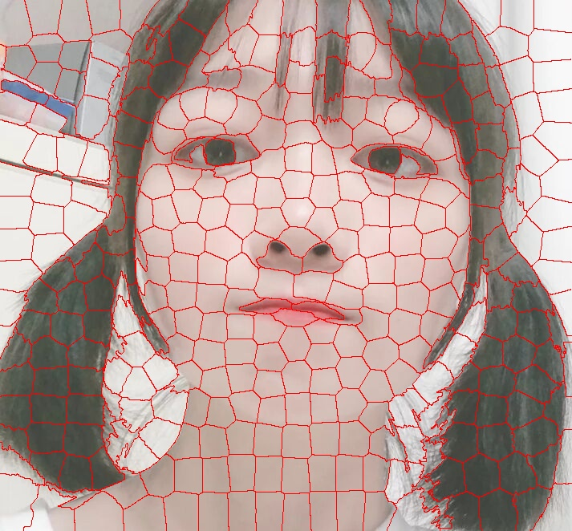
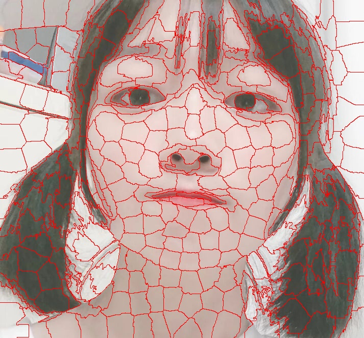

# 
SLIC简单线性迭代聚类

## 
陈诚

### 
概述

超像素指一系列位置相近且颜色, 纹理, 特征等特征相似的像素点组成的小区域. 这些小区域大多保留了进一步进行图像分割的有效信息, 且一般不会破坏图像中物体的边界信息.

超像素分割即将一副像素级的输入图片, 分割成区域级的图, 是对基本信息元素进行的抽象.

$SLIC$**简单线性迭代聚类**算法是一种采用$k$均值算法生成超像素的算法, 其有以下特点:

1. 将搜索空间限制为与超像素大小成比例的区域, 显著地减少了迭代中的距离计算的数量
2. 组合颜色距离与空间距离加权计算样本与聚类中心的距离
3. 可对超像素的尺寸与连通性进行控制

### 
算法描述

1. 算法输入:原始图像、预想分割的超像素数$k$、簇内最大颜色距离$N_c$

2. 算法步骤:

   1. 根据图像大小及预想分割的超像素数计算簇中心的步长$S​$, 亦即簇内最大空间距离$N_s​$

      $$S = N_c = \sqrt{(ImageHeight * ImageWidth / k)}​$$

   2. 将图像从$RGB$空间转化到$LAB$空间, 每个像素点对应一个五维向量$[l, a, b, x, y]$

   3. 根据步长$S$在图像上规则选取$k$个簇中心

   4. 将每个簇中心移动到其$3\times 3​$邻域里梯度最小(最平坦)的点

   5. 初始化所有像素点所在的簇$label$为$-1$, 到簇中心的**距离**$distance$为$\infty$

   6. 迭代如下过程:

      1. 对每个簇中心$2S\times 2S$的邻域内的点, 计算其到簇中心的**距离**

         颜色距离为$d_c=\sqrt{(l_j-l_i)^2+(a_j-a_i)^2+(b_j-b_i)^2}​$

         空间距离为$d_s=\sqrt{(x_j-x_i)^2+(y_j-y_i)^2}$

         根据$N_c, N_s$正则化距离为$distance = \sqrt{(\frac{d_c}{N_c})^2+(\frac{d_s}{N_s})^2}​$

      2. 根据到簇中心距离将像素划分进距离最近的簇

      3. 将新的簇内像素进行平均计算得到新的簇中心

   7. 后处理: 对迭代完成的簇进行尺寸与连通性的控制

3. 算法输出: 将处于簇边界的像素点标注在图像中加以显示

### 
算法分析

1. 初始化时在$3\times 3$邻域内重新选取梯度最小的点, 是为了避免初始簇中心像素点落在梯度较大的边界上
2. $SLIC$算法不计算簇中心到所有样本点的距离, 仅计算与$2S\times 2S$邻域内的像素点的距离, 加速算法收敛

3. 实践发现$10​$次迭代对绝大部分图片都可以得到较理想效果, 故一般迭代次数取$10​$
4. 最大颜色距离$N_c$随图片不同而不同, 也随聚类不同而不同, 故一般取一固定常数$m\in[1, 40]$

### 
结果分析

$k = 400, N_c = 40​$

  <table style="width=100%">
	  <tr>
  		<td>
    	  
    		<figcaption align="middle">Input Image</figcaption>
  		</td>
  		<td>
    	  
    		<figcaption align="middle">Without Connectivity Enforce</figcaption>
  		</td>
	  </tr>
      <tr>
  		<td>
    	  
    		<figcaption align="middle">Output Image</figcaption>
  		</td>
  		<td>
    	  
    		<figcaption align="middle">Nc = 10</figcaption>
  		</td>
	  </tr>
  </table>

1. 在没有后处理的结果图中, 有一些孤立的较小的超像素.
2. 最大颜色距离$N_c​$较大时, 空间邻近性更重要. 反之若取$N_c = 10​$, 则颜色邻近性更重要.

### 
运行方式

`python slic.py IMAGE SUPERPIXELS NC`